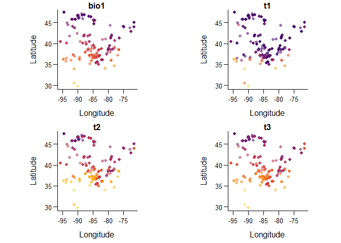

README
================

# vuln

Niche-based vulnerability of species and communities.

## Citation

Smith, R.J., S. Jovan, and B. McCune. 2019. Climatic niche limits and
community-level vulnerability of obligate symbioses. *Journal of
Biogeography* xx: yy-zz.
[doi:10.1111/jbi.13719](https://doi.org/10.1111/jbi.13719)

## What

This package permits calculating single-species vulnerabilities as well
as three metrics of multi-species community vulnerability. Extensions
from single to multiple environmental factors are provided (under active
development).

## Why

Species’ occurrences indicate their realized niche, i.e., their
tolerance to climate, disturbance, and other factors at particular
geographic locations. Probability densities in niche space indicate
habitat suitability: a common pattern is many occurrences at central
values and fewer at niche extremes. If niche extremes (say, \>95th
percentile) indicate conditions beyond which a species will decline to
local extinction, then occurrences very near these extremes may be
defined as “vulnerable”.

Mapped across landscapes, estimating joint vulnerability for many
species simultaneously will permit the targeting of locations where the
greatest shifts in community composition are expected. /

## Installation

Install the package from github as follows:

``` r
install.packages('devtools')
devtools::install_github('phytomosaic/vuln')
devtools::install_github('phytomosaic/ecole')
```

And please cite
    as:

``` r
citation('vuln')
```

    ## Warning in citation("vuln"): no date field in DESCRIPTION file of package
    ## 'vuln'

    ## 
    ## To cite package 'vuln' in publications use:
    ## 
    ##   Robert Smith (2019). vuln: Niche-based Vulnerability of Species
    ##   and Communities. R package version 0.0.04-2019-08-06.
    ##   https://github.com/phytomosaic/vuln
    ## 
    ## A BibTeX entry for LaTeX users is
    ## 
    ##   @Manual{,
    ##     title = {vuln: Niche-based Vulnerability of Species and Communities},
    ##     author = {Robert Smith},
    ##     year = {2019},
    ##     note = {R package version 0.0.04-2019-08-06},
    ##     url = {https://github.com/phytomosaic/vuln},
    ##   }

## Run the entire script to reproduce Smith, Jovan and McCune (2019)

Reproduce analyses from the publication. Warning\! May take several
minutes\!

``` r
source('./demo/script_for_publication.R')
```

## A minimal working example

### Load data

Get some spatial data, with species and environment:

    ## Loading required package: vuln

    ## Registered S3 method overwritten by 'crs':
    ##   method         from
    ##   predict.gsl.bs np

    ## Loading required package: ecole

    ## Loading required package: vegan

    ## Loading required package: permute

    ## Loading required package: lattice

    ## This is vegan 2.5-5

    ## 
    ## Attaching package: 'ecole'

    ## The following objects are masked from 'package:vuln':
    ## 
    ##     add_text, colvec, describe, mae, overlap, plot_loess, set_par,
    ##     surfcol

``` r
data(braun, package = 'ecole')
spe <- braun$spe
env <- braun$env
```

### Vulnerability estimates

Calculate vulnerability
    values:

``` r
v <- vuln(spe, y=env$bio1)  # w/o bingrid, may be 'truncated' niche
```

    ## ECDF from pointwise data: 347 sites, 123 species. Niche may be truncated.

    ##  variable 1 of 1

This used the same locations for both calibration (of niches) and
estimation (of vulnerability), therefore giving a message that your
niche estimates may potentially be ‘truncated’.

### Mapping

Map vulnerability values (and original environmental values) in
geographic space:

``` r
d <- data.frame(env, t1 = gv(v,1), t2 = gv(v,2), t3 = gv(v,3))
ecole::set_par(4)
plot(d$lat, d$lon, col=ecole::colvec(d$bio1), pch=16, main='bio1')
plot(d$lat, d$lon, col=ecole::colvec(d$t1),   pch=16, main='t1')
plot(d$lat, d$lon, col=ecole::colvec(d$t2),   pch=16, main='t2')
plot(d$lat, d$lon, col=ecole::colvec(d$t3),   pch=16, main='t3')
```

<!-- -->

### Vulnerability estimates, permitting ‘extended’ niches

Alternatively, you can use potentially ‘extended’ niches from, e.g.,
herbarium records or more extensive sampling throughout environmental
space that more fully depict the realized niche:

``` r
# first, make species binary
pa  <- (spe>0)*1
dimnames(pa) <- dimnames(spe)

# next, get environmental values at each species occurrence, 
#     then collect in long format
`dematrify` <- function (taxa, thresh = -999) {
     # straight from Dave Roberts' labdsv::dematrify
     tmp <- which(taxa > thresh, arr.ind = TRUE)
     ii <- dimnames(tmp)[[1]]
     jj <- dimnames(taxa)[[2]][tmp[, 2]]
     abu <- taxa[tmp]
     ord <- order(tmp[, 1], tmp[, 2])
     res <- data.frame(ii[ord], jj[ord], abu[ord])
     names(res) <- c("site", "spp", "value")
     return(res)
}
x      <- dematrify(pa)
x$lon  <- dematrify(pa*env$lon)$value
x$lat  <- dematrify(pa*env$lat)$value
x$bio1 <- dematrify(pa*env$bio1)$value

# bin to grid: aggregate observations within grid cells to moderate
#    the effects of unequal sampling efforts
xrng <- range(x$lon)
yrng <- range(x$lat)
ybin <- bingrid(x, field = 'bio1', nr=10, nc=15, 
                xmn=xrng[1], xmx=xrng[2], ymn=yrng[1], ymx=yrng[2])

# calculate vulnerability values
v <- vuln(spe, y=env$bio1, ybin=ybin)
```

    ## ECDF from rasterized data: 150 sites, 123 species. Niche is extended.

    ##  variable 1 of 1

``` r
# mapping
d <- data.frame(env, t1 = gv(v,1), t2 = gv(v,2), t3 = gv(v,3))
ecole::set_par(4)
plot(d$lat, d$lon, col=ecole::colvec(d$bio1), pch=16, main='bio1')
plot(d$lat, d$lon, col=ecole::colvec(d$t1),   pch=16, main='t1')
plot(d$lat, d$lon, col=ecole::colvec(d$t2),   pch=16, main='t2')
plot(d$lat, d$lon, col=ecole::colvec(d$t3),   pch=16, main='t3')
```

<!-- -->

Please contact `smithr2@oregonstate.edu` for updates.
