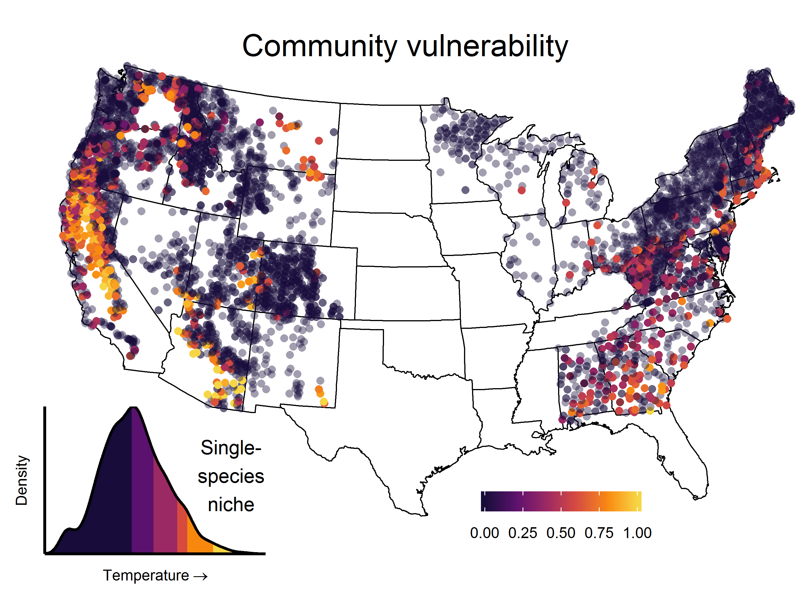

```{r setup, include=FALSE}
knitr::opts_chunk$set(echo = TRUE)
```

Niche-based vulnerability of species and communities.


## Citation

Smith, R.J., S. Jovan, and B. McCune. 2019. Climatic niche limits and community-level vulnerability of obligate symbioses. *Journal of Biogeography* xx: yy-zz. [doi:10.1111/jbi.13719](https://doi.org/10.1111/jbi.13719)


## What

This package permits calculating three metrics of multi-species community vulnerability (as well as single-species vulnerabilities).  Extensions from single to multiple environmental factors are provided (under active development).


## Why

<div style="display: inline-block;">



Species' occurrences indicate their realized niche, i.e., their tolerance to climate, disturbance, and other factors at particular geographic locations.  Probability densities in niche space indicate habitat suitability: a common pattern is that a species will have many occurrences at central values and very few at niche extremes.  If niche extremes (say, >95th percentile) indicate conditions beyond which a species will decline to local extinction, then occurrences very near these extremes may be defined as "vulnerable".  

Mapped across landscapes, estimating joint vulnerability for many species simultaneously will permit the targeting of locations where the greatest shifts in community composition are expected.

</div>

******************************************************************

## Installation

Install the package from github as follows:
```{r install, eval = FALSE}
install.packages('devtools')
devtools::install_github('phytomosaic/vuln')
devtools::install_github('phytomosaic/ecole')
citation('vuln')
```


## I.   Run the entire script to reproduce Smith, Jovan and McCune (2019)

Reproduce analyses from the publication.  Warning!  May take several minutes!

```{r rundemo, eval = FALSE}
source('./demo/script_for_publication.R')
```


## II.  A minimal working example


#### Load data

Get some spatial data, with species and environment.  Here we use tree communities from E. Lucy Braun\'s landmark book _Deciduous Forests of Eastern North America_.

```{r requirepkgs, message=FALSE}
require(vuln)
require(ecole)
?braun
data(braun, package = 'ecole')
spe <- braun$spe
env <- braun$env
```


#### Vulnerability estimates

Calculate vulnerability values.  Because in this example we use the same locations for both calibration (of niches) and estimation (of vulnerability), we get a message that niche estimates may be 'truncated'.

```{r vuln}
v <- vuln(spe, y=env$bio1)
```


#### Visualize

Map vulnerability values (and original environmental values) in geographic space:

```{r mapping}
d <- data.frame(env, t1 = gv(v,1), t2 = gv(v,2), t3 = gv(v,3))
`f` <- function(xx) {
     xx <- as.character(xx)
     plot(d$lon, d$lat, col=ecole::colvec(d[,xx]), pch=16, main=xx,
          xlab='Longitude', ylab='Latitude')
}
ecole::set_par(4)
f('bio1')
f('t1')
f('t2')
f('t3')
```

According to this, tree communities are most vulnerable to increases in Mean Annual Temperature at the southern edge of E. Lucy Braun\'s study area.

Since the study area may not encompass all realized niches, we can use another method to 'extend' the niches beyond the focal area.
  

## III.  Example using 'extended' niches

Alternatively, you can use potentially 'extended' information that more fully depicts the realized niche.  Usually you will source this info from e.g., herbarium records, or else more extensive sampling throughout environmental space (however, our example below still uses the same site info).

#### Get environmental values for each occurrence observation

```{r getenv}
pa <- (spe>0)*1 # convert species abundance matrix to binary pres/abs
dimnames(pa) <- dimnames(spe)

# `dematrify` function to convert occurrences to 'long' format,
#     is straight from Dave Roberts' labdsv::dematrify
`dematrify` <- function (taxa, thresh = -999) {
     tmp <- which(taxa > thresh, arr.ind = TRUE)
     ii  <- dimnames(tmp)[[1]]
     jj  <- dimnames(taxa)[[2]][tmp[, 2]]
     abu <- taxa[tmp]
     ord <- order(tmp[, 1], tmp[, 2])
     res <- data.frame(ii[ord], jj[ord], abu[ord])
     names(res) <- c("site", "spp", "value")
     return(res)
}

# finally, get environmental values at each occurrence
x      <- dematrify(pa)
x$lon  <- dematrify(pa*env$lon)$value
x$lat  <- dematrify(pa*env$lat)$value
x$bio1 <- dematrify(pa*env$bio1)$value
```


#### Account for unequal sampling efforts

Aggregate observations within grid cells to moderate the effects of unequal sampling efforts.

```{r bingrid}
xrng <- range(x$lon)
yrng <- range(x$lat)
ybin <- bingrid(x, field = 'bio1', nr=10, nc=15, 
                xmn=xrng[1], xmx=xrng[2], ymn=yrng[1], ymx=yrng[2])
# here we use a grid of 10 rows x 15 columns across eastern N America
#   choice of grid size will affect results
```


#### Finally, calculate vulnerability from the gridded values

Calculate vulnerability values.  Because in this example we supplied external information in `ybin`, we get a message that niche estimates are 'extended'.

```{r vuln2}
v <- vuln(spe, y=env$bio1, ybin=ybin) # using *gridded values*
```


#### Visualize

```{r mapping2}
d <- data.frame(env, t1 = gv(v,1), t2 = gv(v,2), t3 = gv(v,3))
ecole::set_par(4)
f('bio1')
f('t1')
f('t2')
f('t3')
```

That\'s it! Please contact `smithr2@oregonstate.edu` for updates.
